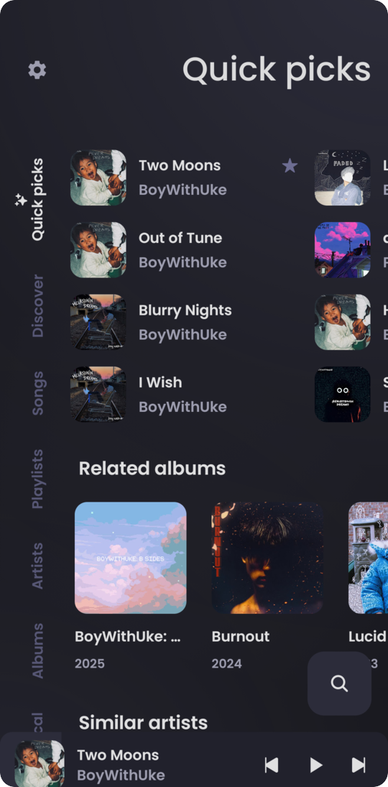
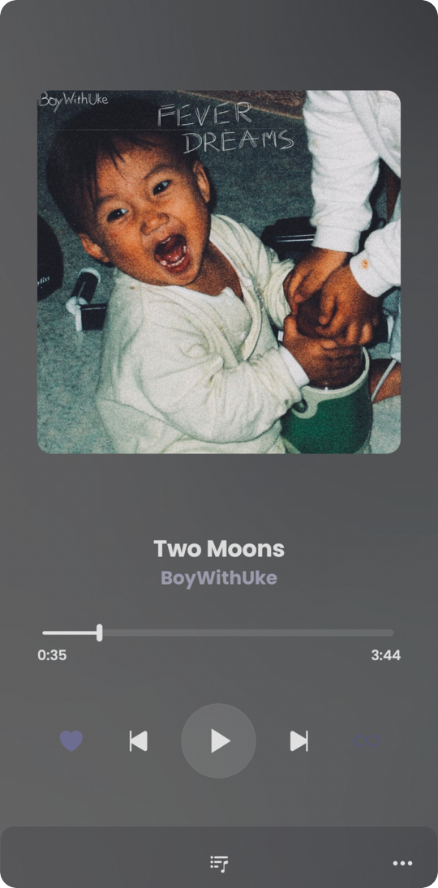
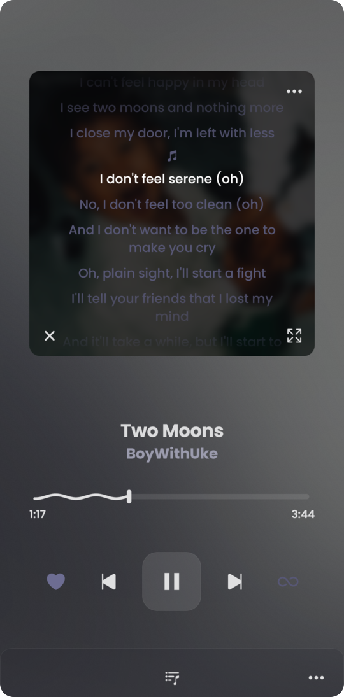
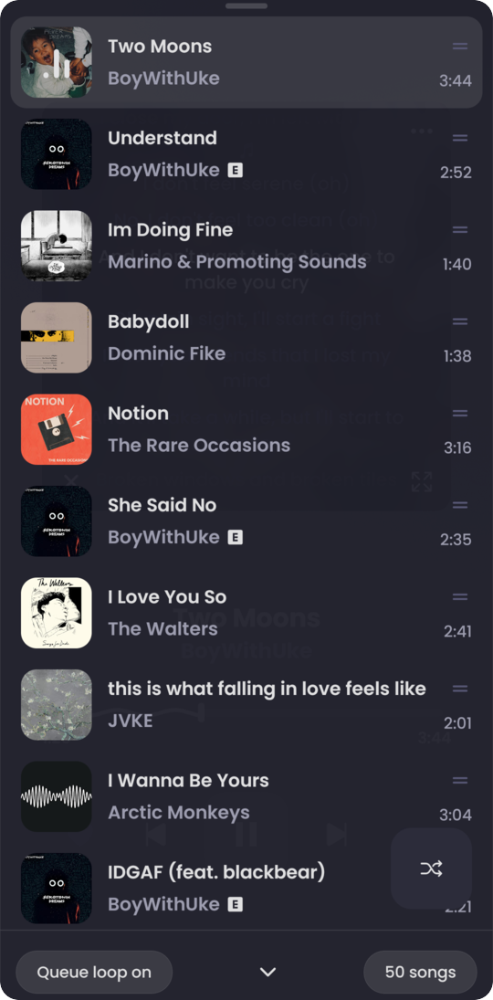
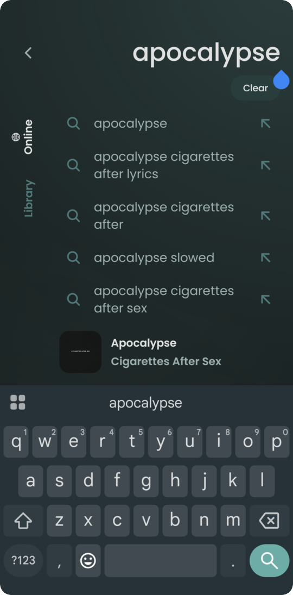
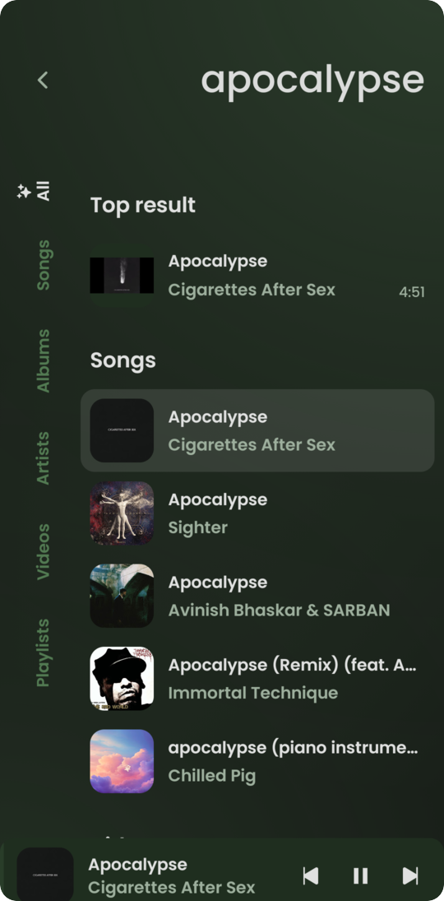
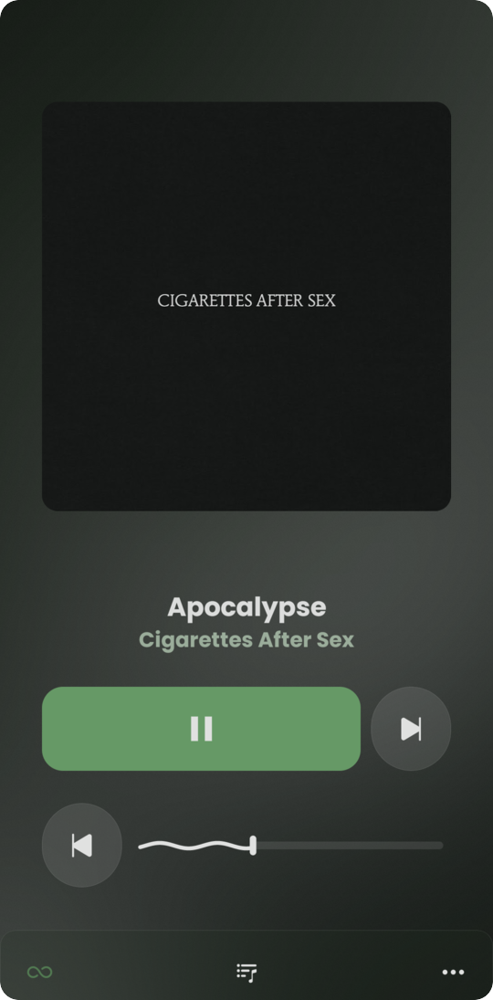
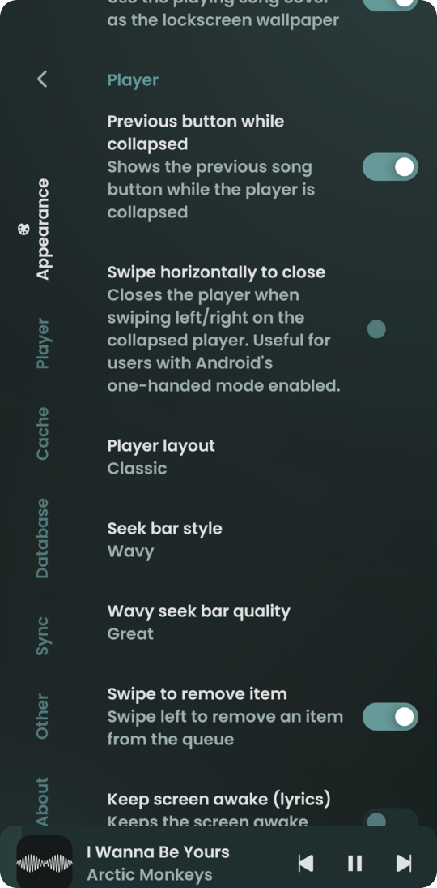

  
  <h1>eXMusic</h1>
  
An Android music player powered by YouTube Music.

---

## Screenshots

<table>
  <tr>
    <td align="center"> Home feed</td>
    <td align="center"> Player</td>
    <td align="center"> Synced lyrics</td>
    <td align="center"> Queue</td>
  </tr>
  <tr>
    <td align="center"> Instant search</td>
    <td align="center"> Search results</td>
    <td align="center"> Modern layout</td>
    <td align="center"> Settings</td>
  </tr>
</table>

---

## What is eXMusic

eXMusic is a fast, clean Android music player built on top of ViTune and ViMusic. It streams directly from YouTube Music with zero ads, supports background playback, and caches tracks locally so your music stays available offline.

---

## What we added

- **Aurora theme.** Album artwork lights up the background with a soft, moving glow and frosted glass controls. You can keep the effect inside the player or spread the ambient glow across the entire app.
- **Faster, lighter performance.** Color palette extraction runs in the background off the main thread, and background wakeups during playback were removed. The UI stays smooth while drawing less power and memory than other clients.
- **Reliable playback.** Music starts quickly and keeps playing even if a stream drops or gets blocked. Smooth crossfade between tracks keeps the music going without awkward silence.
- **Clickable synchronized lyrics.** Tap any line in time-synced lyrics to jump right to that part of the song. You can scroll through lyrics freely without the screen fighting you or snapping back.
- **Home feed and charts.** Explore YouTube Music charts, trending releases, and mood playlists straight from the home screen instead of only seeing songs you already played.
- **Instant search.** Results show up as you type into a single search bar, organized cleanly so you find artists, tracks, and albums faster.
- **Clean look.** A refreshed icon and polished UI that fits right into modern Android, with full support for themed system icons.

---

## Features

- Play any song, album, or playlist from YouTube Music without ads
- Background playback and Android Auto support
- Cache songs for offline playback
- Synchronized and plain text lyrics with search and time offset controls
- Create local playlists or import them from YouTube
- Audio normalization and skip silence
- Open YouTube and YouTube Music links directly in the app
- Lightweight installation with low memory usage

---

## Installation

Download the latest APK from the [Releases](https://github.com/exilonium/exmusic/releases/latest) page, or install and track updates through [Obtainium](https://apps.obtainium.imranr.dev/redirect?r=obtainium://add/https://github.com/exilonium/exmusic/).

---

## Acknowledgments

- [ViTune](https://github.com/bartoostveen/ViTune) and [ViMusic](https://github.com/vfsfitvnm/ViMusic), the original projects eXMusic builds upon.
- [ZiMusic](https://github.com/Jigen-Ohtsusuki/ZiMusic), for the Aurora background inspiration and design.
- [Metrolist](https://github.com/MetrolistGroup/Metrolist), for direct YouTube Music stream resolution concepts.
- [YouTube-Internal-Clients](https://github.com/zerodytrash/YouTube-Internal-Clients), for reference material on client endpoints.
- [ionicons](https://github.com/ionic-team/ionicons), for icons used throughout the interface.

---

## License

eXMusic is released under the [GNU General Public License v3.0](LICENSE), the same license as
ViTune and ViMusic, the projects it builds upon. Any redistributed or modified copy has to stay
under GPL-3.0 and ship its source.

---

## Disclaimer

This project is not affiliated with, funded by, or associated with YouTube or Google LLC. All trademarks and registered trademarks belong to their respective owners.
